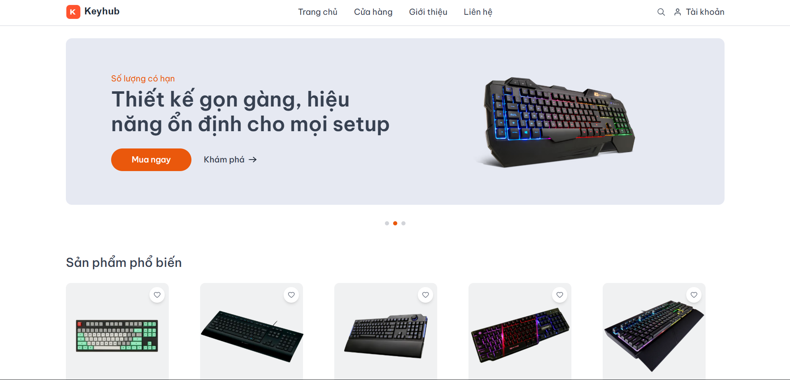
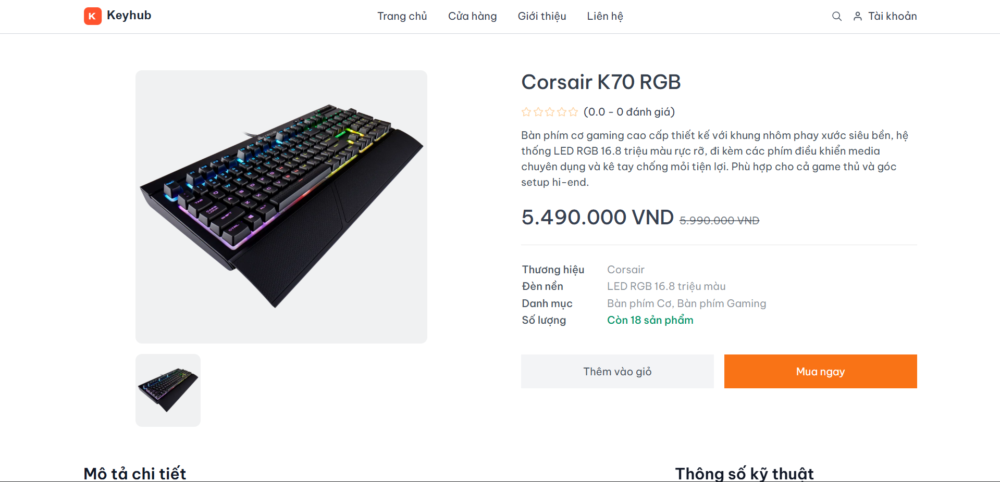
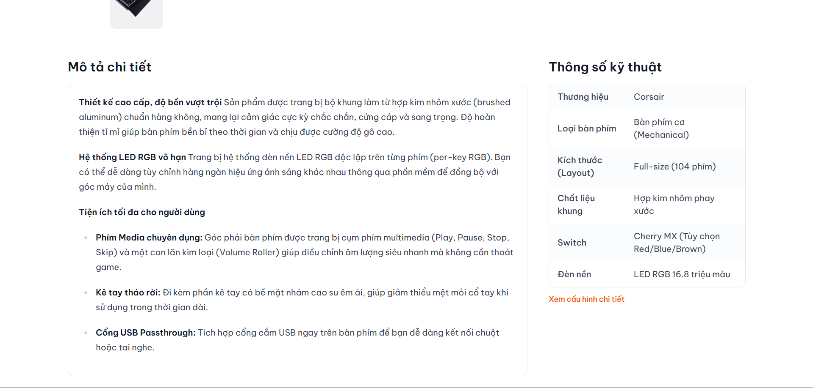

# KeyHub


Nền tảng E-Commerce full‑stack xây bằng Next.js (App Router): có luồng mua hàng cho user + dashboard quản trị cho seller, tích hợp Clerk Auth, MongoDB (Mongoose), Cloudinary (ảnh), Inngest (background jobs) và Resend (email liên hệ).

## Tính năng chính

- **User**: xem sản phẩm, giỏ hàng, đặt hàng, theo dõi đơn, yêu thích (favorites), đánh giá sản phẩm (kèm upload ảnh).
- **Seller**: quản lý sản phẩm (CRUD), danh mục, nhà cung cấp, tồn kho/phiếu nhập, đơn hàng của seller.
- **Bảo vệ route**: chặn `/seller/*` bằng middleware dựa theo role của Clerk (`publicMetadata.role = "seller"`).
- **Inngest jobs**: sync user từ Clerk vào DB, batch tạo order, tự động cập nhật `averageRating/totalReviews` theo review.
- **Contact**: form liên hệ gửi email qua Resend.

## Tech Stack

- **Framework**: Next.js 15 (App Router), React 19
- **Styling**: TailwindCSS
- **Auth**: Clerk
- **Database**: MongoDB + Mongoose
- **Media**: Cloudinary (+ `next-cloudinary`)
- **Background Jobs**: Inngest
- **Email**: Resend
- **Validation**: Zod

## Getting Started

### Yêu cầu

- Node.js >= 18.18 (khuyến nghị 20+)
- MongoDB (local hoặc Atlas)
- Tài khoản Clerk + Cloudinary (và Resend nếu dùng Contact)

### Cài đặt

```bash
# 1) Clone
git clone <your-repo-url>

# 2) Install deps
cd KeyHub
npm install

# 3) Tạo env
cp .env.example .env

# 4) Run dev (Turbopack)
npm run dev
```

Mở `http://localhost:3000`.

### (Tuỳ chọn) chạy Inngest Dev Server

Nếu bạn muốn chạy background jobs ở local:

```bash
npx inngest-cli@latest dev -u http://localhost:3000/api/inngest
```

## Environment Variables

Project đã có sẵn file `.env.example`. Các biến quan trọng:

| Key | Required | Description |
| --- | --- | --- |
| `MONGODB_URI` | Yes | MongoDB base URI (app sẽ tự nối thêm `/KeyHub`) |
| `NEXT_PUBLIC_CLERK_PUBLISHABLE_KEY` | Yes | Clerk publishable key |
| `CLERK_SECRET_KEY` | Yes | Clerk secret key |
| `CLOUDINARY_CLOUD_NAME` | Yes | Cloudinary cloud name |
| `CLOUDINARY_API_KEY` | Yes | Cloudinary API key |
| `CLOUDINARY_API_SECRET` | Yes | Cloudinary API secret |
| `NEXT_PUBLIC_CLOUDINARY_UPLOAD_PRESET` | Yes (để upload ảnh review) | Upload preset cho client |
| `RESEND_API_KEY` | Optional | Bật tính năng gửi mail ở trang Contact |
| `RESEND_FROM_EMAIL` | Optional | Sender email (Resend) |
| `CONTACT_RECEIVER_EMAIL` | Optional | Email nhận contact (default = sender) |

## Scripts

```bash
npm run dev     # next dev --turbopack
npm run build   # production build
npm run start   # start production server
npm run lint    # eslint
```

## Demo & Screenshots

- Live demo: https://keyhub.cobweb.id.vn
- Screenshots/GIF:

	

	

	

## Contributing

1. Fork repo + tạo branch: `feat/<name>` hoặc `fix/<name>`
2. Mô tả rõ thay đổi trong PR, đính kèm screenshot nếu thay đổi UI
3. Chạy `npm run lint` trước khi mở PR

## License
MIT
